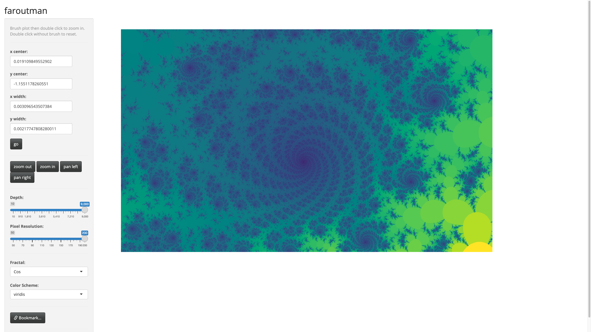

```{r setup,include=FALSE}
#---
#Title: faroutman
#Date: Tue Jun 19 2018 07:58:50 AM
#---

# set the knitr options ... for everyone!
# if you unset this, then vignette build bonks. oh, joy.
#opts_knit$set(progress=TRUE)
opts_knit$set(eval.after='fig.cap')
# for a package vignette, you do want to echo.
# opts_chunk$set(echo=FALSE,warning=FALSE,message=FALSE)
opts_chunk$set(warning=FALSE,message=FALSE)
#opts_chunk$set(results="asis")
opts_chunk$set(cache=TRUE,cache.path="cache/")

#opts_chunk$set(fig.path="github_extra/figure/",dev=c("pdf","cairo_ps"))
#opts_chunk$set(fig.path="github_extra/figure/",dev=c("png","pdf"))
#opts_chunk$set(fig.path="github_extra/figure/",dev=c("png"))
opts_chunk$set(fig.path="man/figures/",dev=c("png"))
opts_chunk$set(fig.width=5,fig.height=4,dpi=64)

# doing this means that png files are made of figures;
# the savings is small, and it looks like shit:
#opts_chunk$set(fig.path="figure/",dev=c("png","pdf","cairo_ps"))
#opts_chunk$set(fig.width=4,fig.height=4)
# for figures? this is sweave-specific?
#opts_knit$set(eps=TRUE)

# this would be for figures:
#opts_chunk$set(out.width='.8\\textwidth')
# for text wrapping:
options(width=64,digits=2)
opts_chunk$set(size="small")
opts_chunk$set(tidy=TRUE,tidy.opts=list(width.cutoff=50,keep.blank.line=TRUE))

#faroutman.meta <- packageDescription('faroutman')
library(faroutman)
#[](http://codecov.io/github/shabbychef/faroutman?branch=master)
#[](https://travis-ci.org/shabbychef/faroutman)
#[](http://codecov.io/github/shabbychef/faroutman?branch=master)

#[](https://cran.r-project.org/package=faroutman)
#[](https://www.r-pkg.org:443/pkg/faroutman)
#[](https://www.r-pkg.org:443/pkg/faroutman)
#from [CRAN](https://cran.r-project.org/package=faroutman "CRAN page"),
```

# faroutman

[](https://github.com/shabbychef/faroutman/actions)


A Shiny app to look at fractals.

-- Steven E. Pav, shabbychef@gmail.com

## Installation

This package can be installed 
via [drat](https://github.com/eddelbuettel/drat "drat"), or 
from [github](https://github.com/shabbychef/faroutman "faroutman")
via devtools:

```{r install,eval=FALSE,echo=TRUE}
# via drat:
if (require(drat)) {
    drat:::add("shabbychef")
    install.packages("faroutman")
}
# get snapshot from github (may be buggy)
if (require(devtools)) {
	# latest greatest
	install_github('shabbychef/faroutman',ref='master')
}
```

# Basic Usage

Run the app via the `faroutman::fractal_app()` function.

## Screenshots





