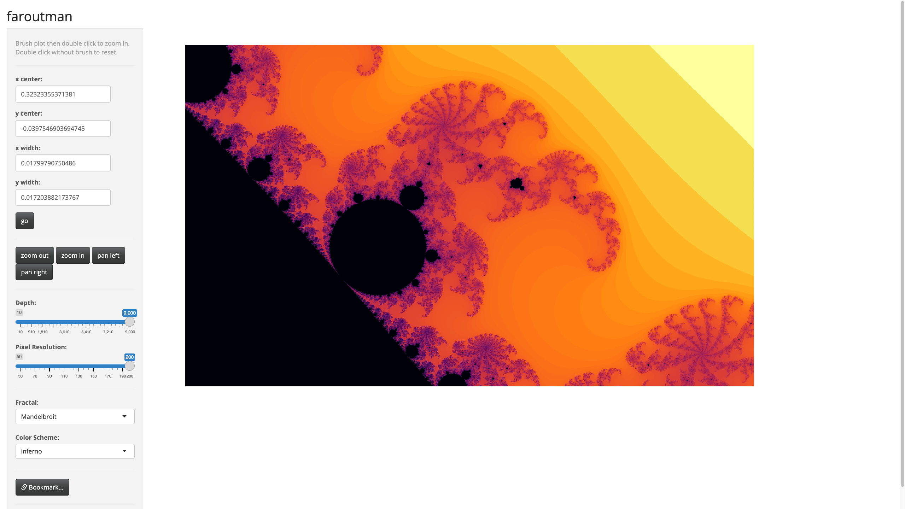
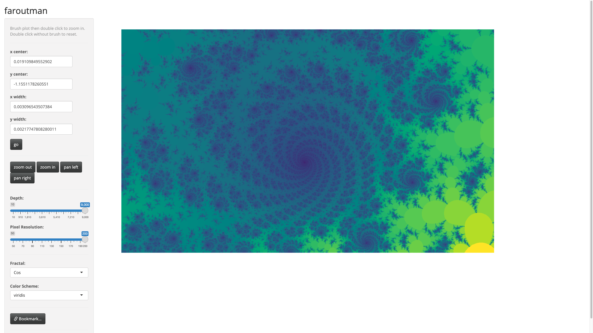

# faroutman

[](https://github.com/shabbychef/faroutman/actions)


A Shiny app to look at fractals.

-- Steven E. Pav, shabbychef@gmail.com

## Installation

This package can be installed 
via [drat](https://github.com/eddelbuettel/drat "drat"), or 
from [github](https://github.com/shabbychef/faroutman "faroutman")
via devtools:


```r
# via drat:
if (require(drat)) {
    drat:::add("shabbychef")
    install.packages("faroutman")
}
# get snapshot from github (may be buggy)
if (require(devtools)) {
	# latest greatest
	install_github('shabbychef/faroutman',ref='master')
}
```

# Basic Usage

Run the app via the `faroutman::fractal_app()` function.

## Screenshots





